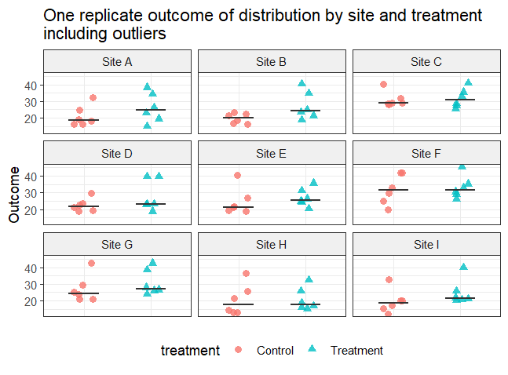
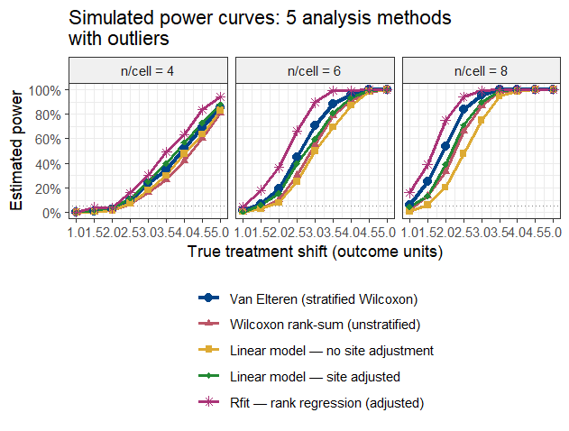
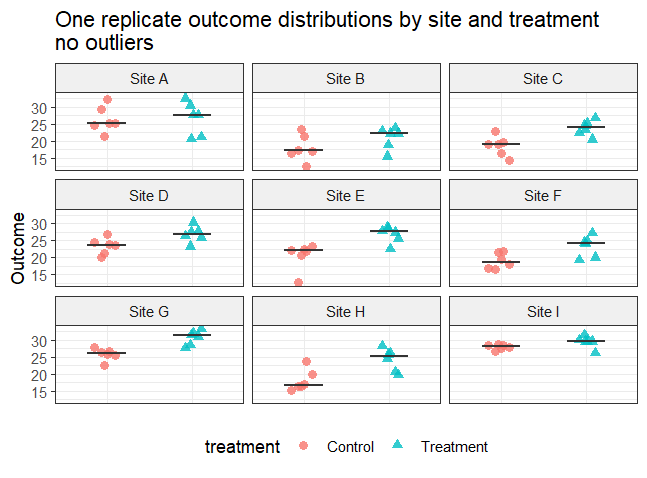
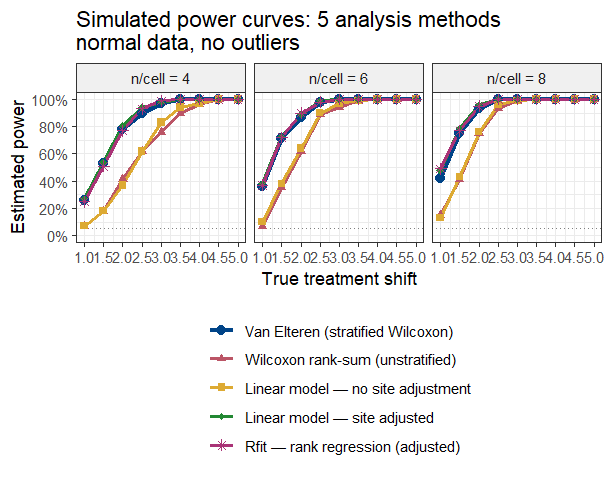

# If you have non-normal data and more than one explanatory variable: Rank methods for multiple explanatory variables

Data that are not normally distributed can cause loss of power and poor p-values for t-test, analysis of variance and multiple regression. The Wilcoxon rank sum test and Kruskal-Wallis help if you only have one explanatory variable, but what if you have more than one variable that affects the outcome? In this chapter we'll look at rank methods that allow for multiple explanatory variables.

Load these libraries to run the examples in this chapter.

```{r}
library(tidyverse)
library(coin)
library(Rfit)
library(rankFD)
```


## Overview of rank methods for multiple explanatory variables

Rank analysis is an active area of statistics research. Several R packages and tools are available. We'll focus on these two: 

- Van Elteren stratified Wilcoxon test (coin package)

- Rank-based regression (Rfit package)


### Van Elteren stratified Wilcoxon test with coin

The van Elteren stratified Wilcoxon test was first published in 1960. Among its advantages are the facts that it is fairly widely known and has been used for FDA submissions and in articles published in the major medical and scientific journals. It has some disadvantages that we'll note shortly. It is available in standard statistics packages such as SAS and R. We'll use the van Elteren test from the R package coin.

### Rank-based regression with Rfit

Rfit is built around rank-based regression as an alternative to ordinary least squares regression. The Rfit package accompanies the textbook “Nonparametric Statistical Methods Using R” by John Kloke and Joseph W. McKean [@kloke2015]. Think of it as a rank-based alternative to lm(). The appendix to this chapter gives a brief comparison of rfit versus traditional least-squares regression.


### rankFD for Rank-based analysis of variance and factorial design 

The rankFD package accompanies the textbook "Rank and Pseudo-Rank Procedures for Independent Observations in Factorial Designs" by Brunner [@brunner2018].

rankFD is built around nonparametric hypothesis testing in factorial designs. It is particulalry useful if you are looking for a rank-based alternative for factorial analysis of variance and experiment design.


## Example data set with outliers

We'll use this anova.2way.data.outlier data set for some of the examples.


```{r}
anova.2way.data.outlier = tibble::tribble(
~Treatment, ~Litter, ~Response,
  "Drug", "Litter.1", 4,
  "Drug", "Litter.1", 8,
  "Drug", "Litter.2", 11,
  "Drug", "Litter.2", 12,
  "Drug", "Litter.3", 13,
  "Drug", "Litter.3", 15,
  "Drug", "Litter.4", 20,
  "Drug", "Litter.4", 32,
  "Placebo", "Litter.1", 10,
  "Placebo", "Litter.1", 15,
  "Placebo", "Litter.2", 16,
  "Placebo", "Litter.2", 17,
  "Placebo", "Litter.3", 19,
  "Placebo", "Litter.3", 20,
  "Placebo", "Litter.4", 21,
  "Placebo", "Litter.4", 31
)

# van Elteren stratified Wilcoxon test from the coin R package  
# requires that covariates are defined to be factors
anova.2way.data.outlier$Litter = as.factor(anova.2way.data.outlier$Litter)
anova.2way.data.outlier$Treatment = as.factor(anova.2way.data.outlier$Treatment)

str(anova.2way.data.outlier)
```


```{r}
ggplot(anova.2way.data.outlier, aes(y=Response, x=Treatment)) + geom_point() +
  facet_wrap(~Litter) +
ggtitle("Response to treatment  \nbroken out by Litter, with outliers")
```

The outliers in litter 4 are evident, as is the large difference in response between the litters.


## Analysis using standard anova

Start with an ordinary two-way ANOVA for this data.

```{r}
lm.2way.outlier = lm(Response ~ Litter + Treatment,
  data= anova.2way.data.outlier)
anova(lm.2way.outlier)
```


The ordinary two-way ANOVA confirms the additional variability due to litter (p = 0.00066) but treatment is not significant (p = 0.054). 


## Rank-based analysis using the van Elteren stratified Wilcoxon test
 
The syntax for the van Elteren stratified Wilcoxon test is to specify the  usual formula "Response ~ Treatment" followed by a vertical bar "|" and the stratification variable, in this case "Litter". As the code below shows, this gives "Response ~ Treatment | Litter". Note also that the van Elteren stratified Wilcoxon test from the R package coin requires that the explanatory variables are defined to be factors.

```{r}
# van Elteren stratified Wilcoxon test
wilcox_test(Response ~ Treatment | Litter,
                  data         = anova.2way.data.outlier,
                  distribution = "asymptotic")

```

The van Elteren stratified Wilcoxon test gives p = 0.008 for treatment, stratifying for Litter, which is an improvement over the non-significant result for the two-way anova.

Watch out for errors in the formula syntax for the stratified Wilcoxon test using wilcox_test. An easy mistake to make (I know, because I've done it) is formatting a stratified test as Response ~ Treatment + Litter. The stratified Wilcoxon using wilcox_test from the coin package must be formatted with a vertical bar indicating the blocking variable: Response ~ Treatment | Litter. 

## Rank-based analysis using the Rfit package

Another alternative for rank-based analysis is the Rfit package. To run these examples, install and load the package with this code:


```{r}
# install.packages("Rfit") # if not already installed
library(Rfit)
```

Here is the analysis of the outlier data, with litter and treatment as the two explanatory variables. The function rfit() performs the analysis.


```{r}
anova.2way.data.outlier.rfit = with(anova.2way.data.outlier,
  rfit(Response ~ Litter + Treatment))
summary(anova.2way.data.outlier.rfit)
```

The rank-based rfit test indicates that treatment has a significant effect (p = 0.017). Compare this result to the conventional two-way ANOVA result of p = 0.054, which indicated that treatment was not significant.

The output also indicates that there are significant differences among the litters. 

We could have started the analysis with an interaction test, using the Rfit function raov. The formula “Response ~ Litter * Treatment” specifies the interaction test.

```{r}
with(anova.2way.data.outlier, raov(Response ~ Litter * Treatment))
```

The interaction test is not significant (p = 0.937), indicating that there is no interaction between treatment and litter. So, the model without interaction was suitable. 


We can also examine the results for rfit for the data with no outliers.


```{r}

anova.2way.data = tibble::tribble(
~Treatment, ~Litter, ~Response,
  "Drug", "Litter.1", 4,
  "Drug", "Litter.1", 8,
  "Drug", "Litter.2", 11,
  "Drug", "Litter.2", 12,
  "Drug", "Litter.3", 13,
  "Drug", "Litter.3", 15,
  "Drug", "Litter.4", 20,
  "Drug", "Litter.4", 21,
  "Placebo", "Litter.1", 10,
  "Placebo", "Litter.1", 15,
  "Placebo", "Litter.2", 16,
  "Placebo", "Litter.2", 17,
  "Placebo", "Litter.3", 19,
  "Placebo", "Litter.3", 20,
  "Placebo", "Litter.4", 21,
  "Placebo", "Litter.4", 23
)
```


```{r}
summary(rfit(Response ~ Litter + Treatment, data = anova.2way.data))
```

We see that, for the data with no outliers, the p-value for the rfit method (p = 0.003456) is similar to the p-value for the classical analysis of variance (p = 0.000545), although not quite so good.


## Compare power for Wilcoxon, stratified Wilcoxon and rfit: data with outliers

Let's run some simulations to compare power for these rank methods. We'll start with a data set that has outliers. Code for the simulations is on the book website.

For this first simulation, we'll assume the following.

- Two group: "Control" and "Treatment"
- Response (y) variable is "Outcome"
- Study is performed at 9 sites. Sites are a source of variation.
- The number of observations per site in each group is 4, 6 or 8. 
- Within each site, within each treatment group, data is randomly sampled from a normal distribution (mean = 20, sd = 4), with the addition of 2 outliers each to the "Control" and "Treatment" groups within each site.
- Within site the Treatment group is shifted relative to the Control group. We use a range of shift values from 1 to 5 by 0.5

The graph below shows the data for one simulation. Notice both the differences among the sites and the differences between treatment groups within each site.

```{r, out.width="100%"}
#| echo: false

```

The graph below shows the power curves comparing the analysis methods over many simulations.

```{r, out.width="100%"}
#| echo: false

```

For this simulated data set with an important covariate (site) and outliers, the methods that ignore the covariate (t-test and Wilcoxon rank sum) have the lowest power. The linear model that adjusts for the site covariate has more power, but lower power than the stratified Wilcoxon and rfit, both of which adjust for the site covariate and handle the outliers without inflating the variance.

How does the power compare for data without outliers? We'll look at that next.


## Compare power for Wilcoxon, stratified Wilcoxon and rfit: no outliers

Now we'll compare the power for the 5 methods for data with no outliers. The data is the same as for the simulation above, except that no outliers are added.

The graph below shows the data for one simulation. Notice both the differences among the sites and the differences between treatment groups within each site.

```{r, out.width="100%"}
#| echo: false

```


The graph below shows the power curves comparing the analysis methods over many simulations.

```{r, out.width="100%"}
#| echo: false

```

For this simulated data set with an important covariate (site) but no outliers, the two methods that ignore the site covariate (linear model with no site adjustment and Wilcoxon rank sum) have the lowest power. The stratified Wilcoxon, rfit, and linear model that adjust for the site covariate all have similar power. For data that are normally distributed with no outliers, rfit is expected to have 95% of the power of the linear model. So the results seen here are not surprising.


## Limitations of the rank methods

Every method (including t-tests, anova, and linear regression) has assumptions and limitations. Here we note limitations of the rank methods considered in this chapter.

### Limitations of the van Elteren stratified Wilcoxon test
 
The van Elteren test (1960) is a stratified extension of the Wilcoxon–Mann–Whitney rank-sum test. It combines within-stratum rank statistics into a single weighted statistic, controlling one or more stratification factors. While useful, the procedure carries several important limitations. These are described in some detail in the textbook by Brunner [@brunner2018].

**Assumes uniform effect cross strata**

The test combines stratum-level rank statistics by weighting them, implicitly assuming a common treatment effect across all strata. If the true effect varies considerably from stratum to stratum (there is a treatment-by-stratum interaction), the single combined p-value can be misleading. It is a good idea to look at the within-stratum results before relying solely on the overall test.

**Reduced power with many small strata**

When the number of strata is large relative to the total sample size, so that many strata contain only a handful of observations, the within-stratum rank information becomes very sparse. The test can lose power compared to an unstratified Wilcoxon test, or even compared to a parametric approach such as a mixed model. A common guideline is to avoid strata with fewer than five observations per treatment arm.

**Ties require careful handling**

Like all rank-based methods, the van Elteren test requires an adjustment when tied observations are present. Standard mid-rank tie-breaking is incorporated into the usual variance formula, but with heavy ties (for example, an ordinal outcome with only a few levels) the normal approximation to the null distribution can be poor, inflating the Type I error rate. In such cases a permutation or exact version of the test should be considered.

**No built-in effect size estimate**

The test produces a p-value, but it does not directly provide an effect-size estimate or confidence interval. To quantify the magnitude of the treatment difference, a companion measure such as the stratified Hodges–Lehmann location shift must be computed separately. Reporting a p-value alone may be insufficient for clinical or scientific interpretation.

**Asymptotic validity requires adequate sample size**

The standard test relies on a large-sample normal approximation. With very small per-stratum sample sizes the approximation may be unreliable. Exact conditional permutation tests are available but are computationally intensive, and software implementations vary in whether they offer this option.

**Sensitive to stratum definition**

The stratification scheme should be defined before the analysis and should reflect genuine a priori prognostic factors. Post-hoc choice of strata or collapsing / splitting strata after seeing the data inflates the Type I error. Regulatory guidance (such as ICH E9) requires pre-specification of the stratification factors in the statistical analysis plan.

**Practical guidance**

None of these limitations invalidates the van Elteren test. It remains a widely-used, nonparametric option for stratified two-group comparisons in clinical trials and observational studies. The key safeguards are to pre-specify the stratification factors and weighting scheme, verify the homogeneity-of-effect assumption, ensure strata are not too small, and supplement the p-value with a suitable effect-size estimate and confidence interval.


### Limitations of Rfit

The rfit package [@kloke2012] implements rank-based estimation and inference for linear models in R. It fits regression coefficients by minimizing a rank-based dispersion function derived from Jaeckel [@jaeckel1972], producing estimates that are robust to non-normality and heavy-tailed errors while retaining high efficiency relative to ordinary least squares. Despite these advantages, the approach has a number of limitations that practitioners should understand before adopting it as a primary analytical strategy.

**Relies on asymptotic theory. May be inaccurate with small samples.**

The standard errors, t-statistics, and F-statistics produced by rfit are justified by large-sample asymptotic arguments. In small datasets the normal and chi-squared approximations underpinning these quantities can be unreliable, leading to poorly calibrated p-values and confidence intervals.

**Choice of score function can affect results**

The method requires selection of a score function (e.g., Wilcoxon, sign, normal, Bent scores) that determines what distributional shape is being targeted. The default Wilcoxon scores are optimal when the error distribution is logistic. Choosing an inappropriate score function can reduce efficiency relative to least squares or relative to the correctly specified rank estimator.

**Estimates are location shift, not conditional means**

Rank-based regression via rfit estimates shift parameters in a location model rather than conditional means. Location shift as an effect descriptor is less familiar to many users than effect sizes based on means.

**Ties in the outcome degrade performance**

Like all rank-based methods, rfit uses mid-rank tie-breaking by default. When the outcome contains many ties, as is common with ordinal scales, rounded measurements, or clumped continuous data, the dispersion function becomes less sensitive to differences among tied values and efficiency is reduced

**Limited availability and regulatory acceptance**

The Rfit package (Kloke & McKean, 2012) is available in R but has no direct equivalent in SAS, Stata, or Python. Moreover, rank-based linear regression has little presence in FDA or EMA guidance documents, so its use as a primary analysis in confirmatory clinical trials requires additional scientific justification compared with OLS or prespecified nonparametric alternatives.

**Practical guidance**

Rfit is best suited to continuous, approximately symmetric outcomes in moderately large samples where robustness to heavy tails or outliers in the response is the primary concern. For small samples, sparse or ordinal outcomes, or settings requiring regulatory acceptance, alternative approaches should be considered alongside or instead of rfit.


## Appendix: How does Rfit rank regression work?

**The core idea**

Most statistical analyses compare groups by calculating averages and asking how far apart those averages are. This works well when the data are well-behaved, but averages are can be greatly affected by a small number of unusually high or low outlier values.

Rfit takes a different approach. Instead of working with the raw measurements, it first converts every observation into its rank, that is, its position in the ordered list of all values. The lowest observation gets rank 1, the next gets rank 2, and so on. The analysis is then carried out on these ranks rather than the original numbers.

Because a rank only records where a value sits relative to the others, not how extreme it actually is, an outlier that is, say, ten times larger than the next highest value has no more influence than if it were just slightly larger. The ranks are far less sensitive to those extreme observations.

**How Rfit differs from ordinary least squares regression**

Standard linear regression finds the line of best fit by minimizing the sum of squared distances between each data point and the line. Squaring those distances means large errors caused by outliers count disproportionately and can distort the fitted line substantially.

Rfit uses the same idea of fitting a line through the data, but it minimizes a rank-based criterion instead of squared distances. In practical terms this means:
- Outliers are handled gracefully. A single extreme value cannot pull the fitted line away from where the bulk of the data sit.
- Covariates are still adjusted for. Just like standard regression, Rfit can include additional variables — such as study site or patient age — to account for factors that are not the primary focus of interest.
- The output is familiar. Rfit produces coefficient estimates, standard errors, and p-values in the same format as ordinary regression, making results straightforward to interpret.
- Efficiency is preserved. When data are perfectly normally Rfit is about 95% as efficient, meaning very little statistical power is sacrificed for the added robustness.

**Why does this matter?**

In many real-world datasets, such as biology experiments, clinical measurements, and laboratory assays, a small proportion of observations fall far outside the typical range. These might reflect genuine biological variation, data-entry errors, or rare events. Whatever the cause, they can mislead standard methods.
Rfit provides a middle ground: it is more resistant to those unusual values than ordinary regression, yet unlike a simple non-parametric test it can still adjust for other variables and handle complex study designs. When data contain outliers, simulations show Rfit detecting real treatment effects at higher rates than either standard regression or unadjusted rank tests.

**In summary**

Rfit is a robust regression method that replaces the raw data with ranks before fitting a standard regression model. It combines the interpretability and flexibility of regression — including the ability to adjust for other variables — with the outlier-resistance of rank-based methods. It is most valuable when data contain skewed distributions or extreme observations, and it sacrifices little when data are well-behaved.

**How to interpret the rfit coefficients**

The coefficients produced by Rfit are interpreted in the same way as those from ordinary linear regression. Each coefficient represents the estimated shift in the outcome associated with a one-unit increase in that predictor, after holding all other predictors constant.

For example, in a clinical trial model of the form “rfit(outcome ~ treatment + site)”, the coefficient for treatment estimates the typical difference in outcome between the treatment and control arms, adjusted for site. A positive value means the treatment group tended to score higher; a negative value means lower. The site coefficients capture how much each site’s typical outcome differs from the reference site, after accounting for treatment.

One subtlety is worth noting. Because Rfit works on ranks internally, the coefficient is technically an estimate of a shift parameter, that is, the amount by which the entire distribution of outcomes in one group is displaced relative to the other. It is not just a comparison of the means or a comparison of the medians.

The p-value and confidence interval accompanying each coefficient are interpreted in the usual way: the p-value tests whether the true shift is zero, and the confidence interval gives a plausible range for the size of the effect. Because Rfit is robust, these inferential summaries are more reliable than those from ordinary regression when the data contain outliers or are non-normally distributed.

