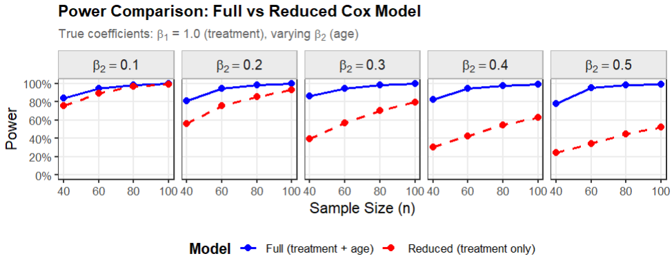
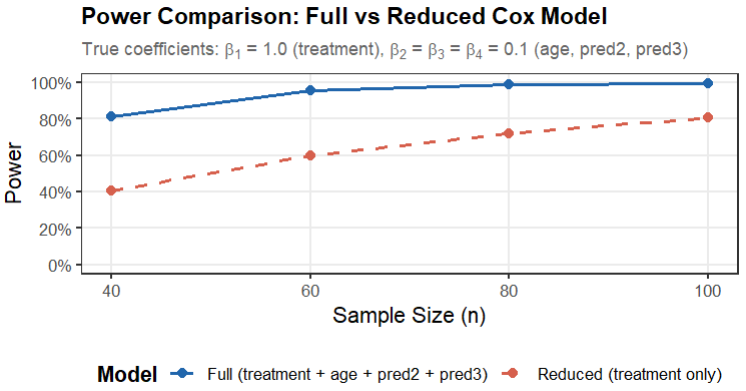
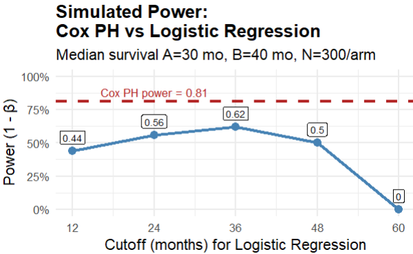

# Survival Analysis


In this chapter we'll look at ways to increase power and get better p-values in survival analyses:

- Avoid log rank tests. Use Cox proportional hazards regression to include covariates that affect survival.

- Omitting important covariates shrinks hazard ratios towards the null hypothesis value and reduces power.

- Balancing covariates across treatment arms is not sufficient. Include covariates in the analysis.

- Avoid testing for a difference in percent surviving at a specific timepoint. Keep the time information and use survival analysis to get better power.

Load these R libraries which are required for the examples.

```{r}
library(survival)
library(ggplot2)
library(tidyverse)
library(survminer)
```

## Avoid log rank tests. Use Cox proportional hazards regression to include additional variables that affect survival, which will increase power.

The standard version of the log rank test has several disadvantages for analysis of survival data compared to Cox proportional hazards regression.

- Has lower power

- Cannot include quantitative variables (such as age, weight, cholesterol)

- Does not provide a quantitative measure of the effect of treatment on survival

While there are versions of the log rank test that address these weaknesses, a simpler solution is to use Cox proportional hazards.

### Example 1: Get better p-values by including a covariate that affects survival

Suppose we examine the effect of caloric restriction (CR) on the lifespan of a particular strain of mice and get the following data. Does treatment (CR or control) have a significant effect on survival? We'll first use a log rank test for treatment without covariates. Then we'll use Cox proportional hazards regression to include the covariate sex.

Here is the R code to generate the data.

```{r}
# mouse.lifespan.data
mouse.lifespan.data = data.frame(
  treatment = c("CR", "CR", "CR", "CR", "CR", "CR", "CR", "CR", "CR", "CR",
                "Control", "Control", "Control", "Control", "Control",
                "Control", "Control", "Control", "Control", "Control"),
  sex = c("M", "M", "M", "M", "M", "F", "F", "F", "F", "F",
          "M", "M", "M", "M", "M", "F", "F", "F", "F", "F"),
  months = c(10, 13, 18, 20, 22, 18, 19, 20, 24, 25,
             9, 10, 14, 17, 18, 12, 15, 16, 21, 22),
  event = c(1, 1, 1, 1, 1, 1, 1, 1, 1, 1,
            1, 1, 1, 1, 1, 1, 1, 1, 1, 1))

mouse.lifespan.data
```

Examine the Kaplan-Meier plots by treatment.

```{r}
# Create life table estimates broken out by treatment
mouse.lifespan.survfit.by.treatment = survfit(Surv(months, event == 1) ~ treatment, data = mouse.lifespan.data)

# Plot using ggsurvplot
ggsurvplot(
  mouse.lifespan.survfit.by.treatment,
  data = mouse.lifespan.data,
  title = "Survival by treatment group",
  legend.title = "Treatment",
  legend = "bottom",
  conf.int = FALSE,
  pval = FALSE,
  risk.table = FALSE,
  legend.labs = c("Control", "Caloric restriction"),
  palette = c("black", "red"),
  linetype = c("solid", "dashed"),
  size = 0.5,
  ggtheme = theme_minimal()
)
```

Examine the Kaplan-Meier plots by sex.

```{r}
# Create life table estimates broken out by sex
mouse.lifespan.survfit.by.sex = survfit(Surv(months, event == 1) ~ sex,
                                        data = mouse.lifespan.data)

# Plot using ggsurvplot
ggsurvplot(
  mouse.lifespan.survfit.by.sex,
  data = mouse.lifespan.data,
  title = "Survival by sex",
  legend.title = "Sex",
  legend = "bottom",
  conf.int = FALSE,
  pval = FALSE,
  risk.table = FALSE,
  legend.labs = c("Female", "Male"),
  palette = c("black", "red"),
  linetype = c("solid", "dashed"),
  size = 0.5,
  ggtheme = theme_minimal()
)
```

The Kaplan-Meier plots suggest that both treatment and sex influence survival.

Here is the log rank test for the effect of treatment.

```{r}
# Log rank test using survdiff
surv.diff.mouse.rx = survdiff(Surv(months, event == 1) ~ treatment,
                              data = mouse.lifespan.data)
surv.diff.mouse.rx
```

The log rank test indicates that treatment is not significant, with p = 0.07.

Notice that the log rank test does not give us a measure of the effect size, such as a hazard ratio.

Here is the log rank test for the effect of sex.

```{r}
surv.diff.mouse.sex = survdiff(Surv(months, event == 1) ~ sex,
                               data = mouse.lifespan.data)
surv.diff.mouse.sex
```

The log rank test indicates that sex is not significant, with p = 0.06.

Now run the Cox regression, using the R function `coxph` from the survival package.

```{r}
# Cox PH for treatment + sex
surv.diff.mouse.ph = coxph(Surv(months, event == 1) ~ treatment + sex,
                           data = mouse.lifespan.data)
summary(surv.diff.mouse.ph)
```

The Cox regression gives p = 0.0398 for treatment and p = 0.0316 for sex. Both are significant.

What do you prefer? Analyses with log rank tests for one variable at a time, showing that neither treatment nor sex is statistically significant? Or the analysis with the Cox regression showing that both treatment and sex are statistically significant?

Notice that the Cox regression also provides the hazard ratios for treatment and sex, which describe the magnitude of their effect on survival.


### Example 2: Get better p-values by including two covariates that affect survival.

Suppose that we run a similar experiment on mouse survival, but now we account for possible effects of litter on lifespan.

Here is the R code to generate the data set.

```{r}
# mouse.lifespan.litter.data
mouse.lifespan.litter.data = data.frame(
  treatment = c("CR", "CR", "CR", "CR", "CR", "CR", "CR", "CR", "CR", "CR",
                "Control", "Control", "Control", "Control", "Control",
                "Control", "Control", "Control", "Control", "Control"),
  sex = c("M", "M", "M", "M", "M", "F", "F", "F", "F", "F",
          "M", "M", "M", "M", "M", "F", "F", "F", "F", "F"),
  litter = c("A", "B", "C", "D", "E", "A", "B", "C", "D", "E",
             "A", "B", "C", "D", "E", "A", "B", "C", "D", "E"),
  months = c(13, 16, 17, 23, 20, 21, 19, 22, 22, 24,
             9, 13, 11, 14, 16, 19, 16, 17, 21, 23),
  event = c(1, 1, 1, 1, 1, 1, 1, 1, 1, 1,
            1, 1, 1, 1, 1, 1, 1, 1, 1, 1))
```

Here are the data.

```{r}
mouse.lifespan.litter.data
```

Here is R code to create the Kaplan-Meier plots.

```{r}
## KM plots

# Create life table estimates broken out by treatment
mouse.lifespan.litter.survfit.by.treatment = survfit(
  Surv(months, event == 1) ~ treatment, data = mouse.lifespan.litter.data)

# Plot using ggsurvplot
ggsurvplot(
  mouse.lifespan.litter.survfit.by.treatment,
  data = mouse.lifespan.litter.data,
  title = "Survival by treatment group",
  legend.title = "Treatment",
  legend = "bottom",
  conf.int = FALSE,
  pval = FALSE,
  risk.table = FALSE,
  legend.labs = c("Control", "Caloric restriction"),
  palette = c("black", "red"),
  linetype = c("solid", "dashed"),
  size = 0.5,
  ggtheme = theme_minimal()
)
```

```{r}
# Create life table estimates broken out by sex
mouse.lifespan.litter.survfit.by.sex = survfit(
  Surv(months, event == 1) ~ sex, data = mouse.lifespan.litter.data)

# Plot using ggsurvplot
ggsurvplot(
  mouse.lifespan.litter.survfit.by.sex,
  data = mouse.lifespan.litter.data,
  title = "Survival by sex",
  legend.title = "Sex",
  legend = "bottom",
  conf.int = FALSE,
  pval = FALSE,
  risk.table = FALSE,
  legend.labs = c("Female", "Male"),
  palette = c("black", "red"),
  linetype = c("solid", "dashed"),
  size = 0.5,
  ggtheme = theme_minimal()
)
```

```{r}
# Create life table estimates broken out by litter
mouse.lifespan.litter.survfit.by.litter = survfit(
  Surv(months, event == 1) ~ litter, data = mouse.lifespan.litter.data)

# Plot using ggsurvplot
ggsurvplot(
  mouse.lifespan.litter.survfit.by.litter,
  data = mouse.lifespan.litter.data,
  title = "Survival by litter",
  legend.title = "Litter",
  legend = "bottom",
  conf.int = FALSE,
  pval = FALSE,
  risk.table = FALSE,
  legend.labs = c("A", "B", "C", "D", "E"),
  palette = c("black", "red", "blue", "purple", "brown"),
  linetype = "strata",
  size = 0.5,
  ggtheme = theme_minimal()
)
```

The Kaplan-Meier plots suggest that there are significant differences due to treatment and sex. There also appears to be some variation in lifespan among the litters, with litter A possibly having shorter lifespans than litters D and E.

Here is the log rank test for the effect of treatment.

```{r}
# Log rank test using survdiff
surv.diff.mouse.rx = survdiff(Surv(months, event == 1) ~ treatment,
                              data = mouse.lifespan.litter.data)
surv.diff.mouse.rx # p = 0.08
```

The log rank test indicates that treatment is not significant, with p = 0.08.

Here is the log rank test for the effect of sex.

```{r}
surv.diff.mouse.sex = survdiff(Surv(months, event == 1) ~ sex,
                               data = mouse.lifespan.litter.data)
surv.diff.mouse.sex # p = 0.02
```

The log rank test indicates that sex is significant, with p = 0.02.

Here is the log rank test for the effect of litter.

```{r}
surv.diff.mouse.litter = survdiff(Surv(months, event == 1) ~ litter,
                                  data = mouse.lifespan.litter.data)
surv.diff.mouse.litter # p = 0.1
```

The log rank test indicates that litter is not significant, with p = 0.1.

Now run the Cox regression, first including just treatment and sex.

```{r}
# Cox PH for treatment + sex
surv.diff.mouse.ph = coxph(Surv(months, event == 1) ~ treatment + sex,
                           data = mouse.lifespan.litter.data)
summary(surv.diff.mouse.ph)
```

The Cox regression gives p = 0.01181 for treatment and p = 0.00455 for sex. That is an improvement in the p-values for both variables compared to the log rank test, which gave a non-significant p = 0.08 for treatment and p = 0.02 for sex.

What if we also include litter in the Cox model? Here are the results.

```{r}
# treatment + sex + litter
surv.diff.mouse.ph = coxph(Surv(months, event == 1) ~ treatment + sex + litter,
                           data = mouse.lifespan.litter.data)
summary(surv.diff.mouse.ph)
```

The Cox regression including both sex and litter as covariates gives p = 0.0012 for treatment, compared to p = 0.0118 for the Cox model with only sex as a covariate, and the non-significant p = 0.08 for treatment from the log rank test that did not include sex or litter as covariates.

What do you prefer? Analysis with the log rank test, showing that treatment is not statistically significant, p = 0.08? Or the analysis with the Cox regression including sex and litter as covariates which shows that treatment is statistically significant, p = 0.0012? Notice that we got this better result without increasing the sample size or making any other change to the experiment. The only thing we had to do was include the covariates in the analysis.

## Omitting important predictors shrinks hazard ratios towards the null hypothesis value and reduces power.

What happens when you run a survival analysis using treatment as the only variable, and you omit a covariate that is an important predictor of survival? Doing so will shrink the coefficient for treatment towards the null hypothesis value of beta = 0. It will shrink the hazard ratio for treatment towards the null hypothesis value, that is, towards hazard ratio = exp(beta) = exp(0) = 1. If you shrink the treatment coefficient beta closer to 0 and make the hazard ratio closer to 1.0 you reduce power and get worse p-values. Let's see an example to demonstrate what happens.

We'll examine the effect of treatment and age on time to an event. We generate data by sampling from an exponential distribution with the following known coefficients.

- Coefficient for treatment = beta1 = 1.0.

- Coefficient for age = beta2 = 0.5.

- Treatment takes values 0 or 1.

- Age is uniformly distributed between 3 and 18.

Here is R code to generate 10,000 observations from the distribution. The large sample size of 10,000 observations will provide accurate values for the estimates of the coefficients.

```{r}
# Generate simulated data
set.seed(1)
n = 10000
treatment = c(rep(0, n/2), rep(1, n/2))
age = runif(n, min = 3, max = 18)  # Important continuous predictor

beta1 = 1.0
beta2 = 0.2

# Hazard: h(t) = h0(t) * exp(beta1*treatment + beta2*age)
hazard = exp(beta1 * treatment + beta2 * age)
time = rexp(n, rate = hazard)
event = rep(1, n)      # No censoring

omit.predictor.data = data.frame(time, event, treatment, age)
```

Here are the first few rows in the data set.

```{r}
head(omit.predictor.data)
```

Let's look at Kaplan-Meier plots for treatment and for age. 

```{r}
### KM plots

# Create life table estimates broken out by treatment
omit.predictor.survfit.by.treatment = survfit(Surv(time, event == 1) ~ treatment, data = omit.predictor.data)

# Plot using ggsurvplot
ggsurvplot(
  omit.predictor.survfit.by.treatment,
  data = omit.predictor.data,
  title = "Survival by treatment",
  legend.title = "treatment",
  legend = "bottom",
  legend.labs = c(0, 1),
  palette = c("black", "red"),
  linetype = c("solid", "dashed"),
  linewidth = 0.5,
  ggtheme = theme_minimal()
)
```

We convert age to a categorical variable just for the Kaplan-Meier plot. Cox regression will use age as a continuous variable.

```{r}
# Create age categories to use in the KM plot
omit.predictor.data = omit.predictor.data %>%
  mutate(age.categorical = case_when(
    age >= 3  & age < 8  ~ "3 to 8",
    age >= 8  & age < 13 ~ "8 to 13",
    age >= 13 & age < 18 ~ "GT13"))

# Create life table estimates broken out by age category
omit.predictor.survfit.by.age = survfit(Surv(time, event == 1) ~ age.categorical, data = omit.predictor.data)

# Plot using ggsurvplot
ggsurvplot(
  omit.predictor.survfit.by.age,
  data = omit.predictor.data,
  title = "Survival by age",
  legend.title = "age",
  legend = "bottom",
  legend.labs = c("3 to 8", "8 to 13", "GT13"),
  palette = c("red", "blue", "black"),
  linetype = "strata",
  size = 0.5,
  ggtheme = theme_minimal()
)
```

Now the Cox regression analyses.

First, the full model (both treatment and age).

```{r}
# Fit Full Model (Correct)
model_full = coxph(Surv(time, event) ~ treatment + age, data = omit.predictor.data)
summary(model_full)$coefficients["treatment", ]
```

In the full model (both treatment and age), the estimated coefficient is 0.98. HR is exp(0.98) = 2.668. These values are very close to the true coefficient of 1.0, and the true hazard ratio of exp(1.0) = 2.718. 

Next, the reduced model (only treatment).

```{r}
model_reduced = coxph(Surv(time, event) ~ treatment, data = omit.predictor.data)
round(summary(model_reduced)$coefficients["treatment", ], digits = 4)
```
In the reduced model (only treatment), the estimated coefficient is 0.70. HR is 2.02.

The reduced model gives values far from the true coefficient of 1.0 and the true hazard ratio of 2.718. The reduced model, omitting the important predictor variable age, shrinks the coefficient for treatment closer to 0 (from 0.98 to 0.70). It shrinks the hazard ratio closer to 1 (from 2.67 to 2.02).

What happens if we run the simulation with a sample size of 60 rather than 10,000? Here are the results from one such run. The R code is the same as above, with n = 60.

Here are results for n = 60 for the full model (both treatment and age).


```{r}
# Create sample of 60 observations from omit.predictor.data
set.seed(123)
omit.predictor.data.60 = omit.predictor.data[sample(nrow(omit.predictor.data), size = 60),]
```


```{r}
# Fit Full Model (Correct)
model_full_60 = coxph(Surv(time, event) ~ treatment + age, data = omit.predictor.data.60)
summary(model_full_60)$coefficients["treatment", ]
```
In the full model (both treatment and age), the estimated coefficient is 0.87. HR is 2.39.

Next, the reduced model (only treatment).

```{r}
model_reduced_60 = coxph(Surv(time, event) ~ treatment, data = omit.predictor.data.60)
round(summary(model_reduced_60)$coefficients["treatment", ], digits = 4)
```


In the reduced model (only treatment), the estimated coefficient is 0.42. HR is 1.51.

Compare these to the true coefficient of 1.0 and the true HR of 2.718. The model omitting age has greatly attenuated the treatment coefficient and HR.

Let's take a thousand samples of size n = 60 and see how often the full model gives p < 0.05 versus how often the reduced model gives p < 0.05. This will tell us how much effect omitting age has on the power for this analysis. The true treatment coefficient is still beta1 = 1.0. Here are results of running 1000 simulations.


| Model | True coefficient of treatment beta1 | True treatment coefficient of age beta2 | Sample size | Power |
|------------|-------------------|-------------------|------------|------------|
| Full | 1.0 | 0.2 | 60 | 0.963 |
| Reduced | 1.0 | 0.2 | 60 | 0.739 |

With a sample size of n = 60, the model including age has power = 0.963, while the model omitting age has power = 0.74. Which do you prefer for your research?

The degree to which omitting an important variable affects the coefficient for treatment depends on both the coefficient for the omitted variable and the sample size. Let's look at the power when we vary beta2, the coefficient for age, from 0.1 to 0.5 and vary sample size from n = 40 to 100. Here are the simulation results in a graph.

```{r, out.width="100%"}
#| echo: false

```

The graph shows that the loss of power caused by omitting an important predictor is larger when the (absolute) value of the omitted variable's coefficient is larger and when the sample size is smaller.

If you have only one omitted variable and it is not an important predictor (coefficient near 0), then it has less impact on the power for the treatment effect. However, if you have multiple omitted variables that each have a small effect, then they may collectively have a large impact on power for the treatment effect, as shown in the graph below. For the simulation shown in the graph, we assumed 3 predictor variables each with a (relatively small) beta of 0.1.

```{r, out.width="100%"}
#| echo: false

```

## Balancing covariates across treatment arms is not sufficient. Include covariates in the analysis.

You may have been told that, if a covariate is balanced across the treatment arms, you do not need to include it in the analysis. This advice is wrong. Omitting an important predictor, even if it is perfectly balanced across treatment arms, will reduce power, give worse p-values, and shrink the hazard ratio towards the null hypothesis value. Here is an example.

Suppose we have the following data.

```{r}
# balanced.data
balanced.data = data.frame(
  treatment = c("Drug", "Drug", "Drug", "Drug", "Drug", "Drug", "Drug", "Drug", "Drug", "Drug",
                "Control", "Control", "Control", "Control", "Control",
                "Control", "Control", "Control", "Control", "Control"),
  age = c("40", "50", "60", "70", "80", "40", "50", "60", "70", "80",
          "40", "50", "60", "70", "80", "40", "50", "60", "70", "80"),
  months = c(10, 13, 18, 20, 22, 18, 19, 20, 24, 25,
             9, 10, 14, 17, 18, 12, 15, 16, 21, 22),
  event = c(1, 1, 1, 1, 1, 1, 1, 1, 1, 1,
            1, 1, 1, 1, 1, 1, 1, 1, 1, 1))

balanced.data
```

There are 10 control subjects and 10 drug subjects. Within each treatment group there are 2 subjects age 40, 2 age 50, and so on, so that age is perfectly balanced between the treatment arms.

```{r}
with(balanced.data, table(age, treatment))
```

Here is the Kaplan-Meier plot.

```{r}
## KM plot by treatment

# Create life table estimates broken out by treatment
balanced.survfit.by.treatment = survfit(Surv(months, event == 1) ~ treatment, data = balanced.data)

# KM plot using ggsurvplot
ggsurvplot(
  balanced.survfit.by.treatment,
  data = balanced.data,
  title = "Survival by treatment group",
  legend.title = "Treatment",
  legend = "bottom",
  legend.labs = c("Control", "Drug"),
  palette = c("black", "red"),
  linetype = c("solid", "dashed"),
  size = 0.5,
  ggtheme = theme_minimal()
)
```

Here is the Cox analysis including only treatment in the model.

```{r}
# Cox PH with only treatment
surv.diff.balanced.ph.treatment = coxph(Surv(months, event == 1) ~ treatment,
                                        data = balanced.data)
summary(surv.diff.balanced.ph.treatment)
```

In the model including only treatment, treatment is not significant, p = 0.0823.

Here is the Cox analysis including age as well as treatment in the model.

```{r}
# Cox PH with treatment + age
surv.diff.balanced.ph = coxph(Surv(months, event == 1) ~ treatment + age, data = balanced.data)
summary(surv.diff.balanced.ph)
```

In the model that includes age and treatment, treatment is significant p = 0.003.

Notice also how omitting age affects the coefficients and hazard ratios, summarized in the table below.

|   | Omit age | Include age as covariate | Consequence |
|-------------|-------------|-------------|-----------------------------------|
| Treatment coefficient | -0.8 | -1.9 | Omitting age shrinks the treatment coefficient towards the null hypothesis value of 0. |
| Treatment hazard ratio | 0.43 | 0.15 | Omitting age shrinks the treatment hazard ratio towards the null hypothesis value of 1.0. |
| Treatment p-value | 0.082 | 0.003 | Omitting age causes the treatment p-value to be non-significant. |

What do you prefer? Omit a covariate because it is balanced across the treatment results, giving a worse p-value and a hazard ratio shrunk toward the null hypothesis? Or include the covariate giving a better p-value and a better hazard ratio?

## Avoid testing for a difference in percent surviving at a specific timepoint. Keep the time information and use survival analysis to get better power.

As an alternative to survival analysis, you might have thought about simply asking, "What percent of each treatment group survives to, say, 24 months." You could do this analysis using a Chi-squared test or a logistic regression (to include important covariates). While using such a cutoff may be attractive as an easy way to present results, it greatly reduces power and gives worse p-values than a Cox proportional hazards regression. Here are results of a simulation to illustrate the loss of power. The R code for the simulation is at the end of this chapter.

For this simulation, we assume the following.

```{r}
#| eval: false
n_sim      = 100  # Number of Monte Carlo replications
n_per_arm  = 300  # patients per treatment arm
median_A   = 30   # median survival in treatment group A (months)
median_B   = 40   # median survival in treatment group B (months)
max_follow = 60   # administrative censoring (months)
# logistic regression cutpoints:
cutoffs    = c(12, 24, 36, 48, 60)  
alpha      = 0.05
```

The graph shows the power for the Cox PH regression versus the logistic regression, where the logistic regression used cutoffs of 12, 24, 36, 48, or 60 months. In these simulations, power for Cox regression is 0.81, which is greater than the power at any cutoff for a logistic regression.

```{r, out.width="100%"}
#| echo: false

```

Here are some of the weaknesses of using cutoffs.

- Using cutoffs throws away information on the actual time to the events.

- Subjects censored before the cutoff are typically excluded. This can introduce bias if censoring is informative.

- Power depends heavily on the chosen cutoff; a poor choice can dramatically reduce power.

- Multiple cutoffs inflate Type I (false positive) error unless corrected. Correction for multiple hypothesis testing further reduces power.


