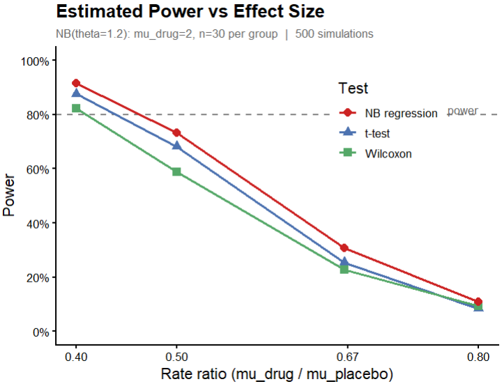
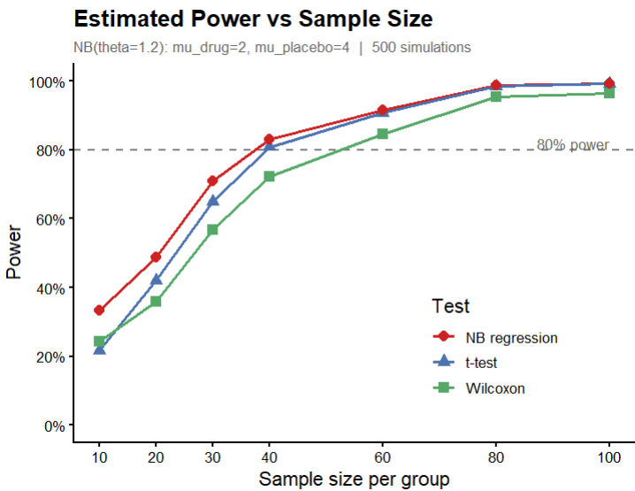
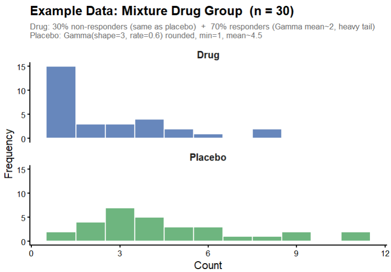
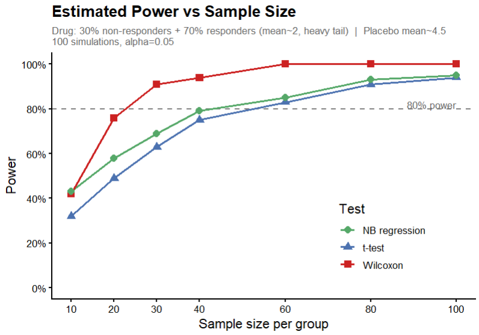

# For count outcomes consider negative binomial regression and Wilcoxon tests

Here are some examples of count data in biology and medicine.

- The number of baby mice in a litter
- The number of bacteria colonies on a culture plate
- The number of days a newborn baby spends in the hospital
- The number of migraine headaches a patient has in one month
- The number of plants of a particular species found in a particular area

If you have count data, you might first think of analyzing it using a t-test or linear regression (to allow covariates). Two alternatives, negative binomial regression, and Wilcoxon rank tests, will sometimes give better power and better p-values for count data, under conditions that we will describe.

Load these libraries to run the examples in this chapter.

```{r}
library(MASS) # use the glm.nb function from the MASS library
library(tidyverse)
```

## Example: Do mice with a genetic variant have smaller litters?

Let's start with a small example to demonstrate negative binomial regression, along with a t-test and a Wilcoxon rank sum test.

A researcher believes that a particular genetic variant may reduce the average litter size in the mouse strain she studies. The response variable is the number of baby mice in the litter. The researcher determines the litter size for 10 wild type mothers and 10 mothers with the genetic variant. For mothers that do not give birth after breeding, the litter size is set to 0.

The following R code sets up the data frame and creates the graph.

```{r}
## Create data set
n.0 = 10
n.1 = 10
litter.sizes.data = data.frame(Genotype = c(rep("Wild type", n.0), rep("Variant", n.1)),
  litter.size = c(1,2,4,4,6,7,7,8,11,12, 0,2,2,2,3,4,4,5,6,8))

# Graph the litter size by genotype
ggplot(litter.sizes.data, aes(y=litter.size, x=as.factor(Genotype), fill=Genotype)) +
  geom_dotplot(binaxis='y', stackdir='center',
               stackratio=1.5, dotsize=1.5) + theme_minimal() +
  theme(legend.position="none") + ylab("Litter size") + xlab("Genotype") + ylim(0,15) +
  ggtitle("Litter size by Genotype")
```

Calculate the mean for each genotype.

```{r}
# Mean by Genotype
with(litter.sizes.data, aggregate(litter.size ~ Genotype, FUN="mean"))
```

In the variant genotype, the mean litter size is 3.6. In the wild type mice the mean is 6.2. We want to know if the difference between the means is statistically significant.

Let's start with a t-test. Here's the R code and output.

```{r}
t.test(litter.size ~ Genotype, data=litter.sizes.data)
```

The t-test gives a non-significant result, p = 0.07.

The researcher might be concerned that the data may not be normally distributed, particularly since litter size can't take negative values. She tries a Wilcoxon rank sum test. Here's the R code and output.

```{r}
wilcox.test(litter.size ~ Genotype, data=litter.sizes.data)
```

The Wilcoxon rank sum test gives a non-significant result, p = 0.11.

Now let's try the negative binomial regression model. Here's the R code and output. We use the `glm.nb` function from the MASS library.

```{r}
# negative binomial model
litter.sizes.nb = glm.nb(litter.size ~ Genotype, data=litter.sizes.data)
summary(litter.sizes.nb)
```

The negative binomial regression gives a significant result, p = 0.045. For this particular data set, we get a better p-value using negative binomial regression. We'll examine more data sets shortly.

## Why not use t-tests or ordinary linear regression for count data?

What happens if you use t-tests or ordinary linear regression to analyze count data, such as the number of migraines per month? There are several reasons why count regression models (Poisson regression or negative binomial regression) or Wilcoxon tests are sometimes better choices for count data, particularly when the number of counts is small (typically mean counts of 1 to 10).

Consider a study of the effect of treatment on the number of migraine headaches a patient has per month. An ordinary linear regression could predict that the number of migraines will be negative. Clearly, a negative number of migraines does not make sense. But that is what an ordinary linear regression may predict.

Linear regression models assume that the residuals are normally distributed. But count data residuals are often not normally distributed. Recall that the residuals for a regression model are the differences between the observed y value and the y value that the model predicts. For example, if the observed number of migraines for a particular patient is 3 per month, and the regression model predicts that they have 2 migraines per month, then the residual is 3 -- 2 = 1. If the residuals are normally distributed around the mean, then counts of (mean + x) and (mean -- x) are equally likely. Taking our migraine example, with mean = 1 migraine per month, having 3 migraines (1 + 2) = 3 is just as likely as --1 migraine (1 -- 2) = --1. But because these are counts, negative values are impossible, and the assumption of normally distributed residuals is violated. Because the calculation of p-values and confidence intervals for linear regression relies on the normality assumption, the p-values and confidence intervals will be incorrect.

Ordinary linear regression models assume that the residuals have constant variance, that is, the same variance for any value of the explanatory variable. Count data models assume that the data have variance that increases as the mean count increases (residuals are Poisson distributed or negative binomial distributed). The predicted values and prediction confidence intervals from an ordinary linear regression that assumes constant variance will be incorrect when variance is not constant.

If ordinary linear regression is used to make predictions of counts given particular values of the explanatory variables, the predicted counts from the linear regression models are likely to have larger errors compared to the predicted counts from count regression models.

For count data that meet the negative binomial distribution assumption, the p-values from a negative binomial regression will usually be better (smaller) than the p-values from t-tests and linear regression (which don't meet the normality and variance assumptions).

## Compare power for data from a negative binomial distribution

The example above used only one data set, one effect size and one sample size. To see if the better p-values for negative binomial regression hold up when we have different effect sizes and different sample sizes, we run a simulation study. We generate 1000 different data sets and vary the sample size per genotype. The code generates data as samples from a negative binomial distribution, which is common for count data. After that, we'll do a similar power simulation using data that is not generated from a negative binomial distribution.

The first graph shows power for the three methods when the mean of the placebo group is 2.5, 3, 4 or 5, and the mean for the drug group is 2. The effect size for a negative binomial regression is sometimes reported as the difference between the means, and is sometimes reported as the rate ratio of the drug mean to the placebo mean. For this graph we show the rate ratio. That is, dividing the drug mean of 2 by the placebo group means of 2.5, 3, 4 or 5 gives us the rate ratios 2/2.5 = 0.8, 2/3 = 0.67, 2/4 = 0.5 and 2/5 = 0.4, which are the values shown on the x-axis of the graph.

{fig-alt="Line graph showing power vs rate ratio for three statistical tests. Negative binomial regression has consistently higher power than t-test or Wilcoxon rank sum test across all rate ratios shown."}

The graph shows power versus the effect size (rate ratio). We see that the negative binomial regression has consistently greater power than either t-test or Wilcoxon rank sum test across a range of rate ratios for these data.

We can also compare the power for different sample sizes, as shown in the graph below. The graph shows power versus the sample size. We see that the negative binomial regression has consistently greater power than either t-test or Wilcoxon rank sum test across a range of sample sizes for these data.

{fig-alt="Line graph showing power vs sample size for three statistical tests. Negative binomial regression achieves higher power at smaller sample sizes compared to the t-test and Wilcoxon rank sum test."}

For this simulation we generated data from a negative binomial distribution. As we noted, this distribution is common for count data. How does power change with data that are not from a negative binomial distribution?

## Compare power when data are from a mixture of distributions

One situation in which the Wilcoxon test may give better results than NB or t-test occurs when the data within at least one group is a mixture. For example, the treatment (drug) group may be a mixture of responders and non-responders.

Here is example data from one such study, where the drug group is a mixture of 70% responders and 30% non-responders. The non-responder's distribution is essentially the same as the distribution for the placebo group. The graph below shows data from one such sample.

{fig-alt="Dot plot or scatter plot illustrating bimodal distribution in the drug group, with a cluster of low values from responders and a cluster of moderate values from non-responders."}

The mixture creates a bimodal structure within the drug group. There is a cluster of low values from responders and a cluster of moderate values from non-responders, plus occasional large outliers from the responders' heavy tail. This inflates the drug group's variance, which causes problems for t-tests and negative binomial models: the t-test suffers from increased variance, and the NB can't fit a single dispersion parameter to a bimodal mixture. The Wilcoxon simply detects that drug values tend to rank lower, which remains true regardless of the outliers and the increased variance.

Power simulations for this data set give the following results.

{fig-alt="Line graph showing power for the three statistical tests when data come from a mixture distribution. The Wilcoxon rank sum test achieves the highest power, followed by NB regression, with the t-test having the lowest power."}

The graph shows that the Wilcoxon rank sum test has the highest power, followed by the NB regression, while the t-test has the lowest power.

There are statistical tests to determine if a particular data sample differs significantly from the NB distribution, so we might think of using them to decide which test to use. Unfortunately, those tests have quite low power for the sample sizes typical in biological data. If the number of observations is 100 or more per treatment group, then power is reasonable to detect moderate deviations from NB, while more than 500 observations per group gives high power to detect almost any deviation from NB.
