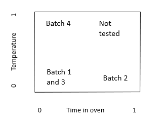
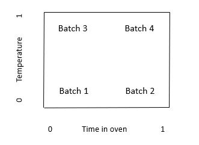
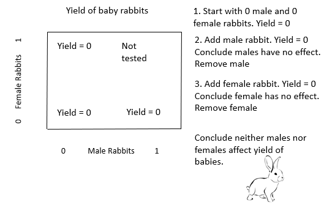
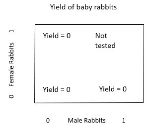
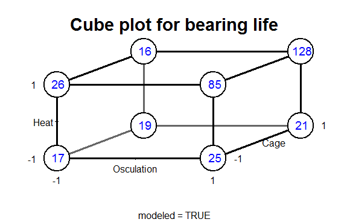
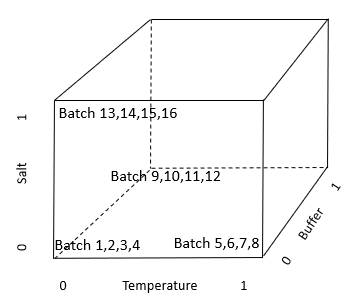
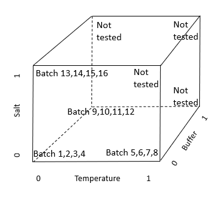
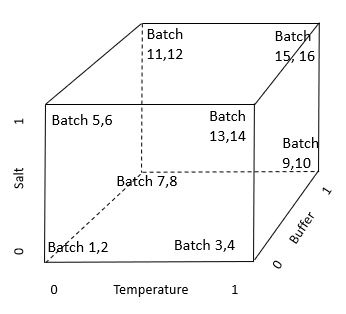

```{r}
#| label: setup
#| include: false
suppressPackageStartupMessages({
  library(kableExtra)
})
```

You have likely heard the advice, "Hold everything constant, change one thing at a time"? This is the one-variable-at-a-time (OVAT) approach.

As you will see in this chapter, OVAT is often a very inefficient and ineffective way to perform an experiment. An alternative to OVAT is factorial experiment design, which you may have encountered as Design of Experiments (DOE).

Compared to OVAT, factorial design of experiments has several advantages:

- Quickly and efficiently test the effects of multiple factors.
- Increase power.
- Get better p-values.
- Detect interactions missed by OVAT.

Factorial designs provide more information with less work than OVAT experiments, as we'll see. Let's start with a familiar example: baking cookies.

## An intuitive view of experiment design: baking cookies

Suppose we are baking cookies. We want to maximize the yield of good cookies. We think that the time in the oven and the temperature in the oven could affect the yield. We plan to bake 4 batches using different combinations of time and temperature in the oven.

**Plan 1.** Here is one possible plan for the 4 batches.



The x axis is time in the oven. 0 is a short time in the oven, and 1 is a long time.

The y axis is temperature in the oven. 0 is a low temperature in the oven, and 1 is a high temperature.

The table shows the time and temperature for each batch.

| Batch number | Time | Temperature |
|---|---|---|
| 1 | 0 | 0 |
| 2 | 1 | 0 |
| 3 | 0 | 0 |
| 4 | 0 | 1 |

Does Plan 1 seem like a good way to design the experiment? Why or why not? Clearly, it seems pretty inefficient and uninformative to test the short time and low temperature (0,0) combination twice, but not to test the short time and high temperature (1,0) combination at all.

**Plan 2.** Here is an alternative plan for the 4 batches.



The table shows the time and temperature for each batch.

| Batch number | Time | Temperature |
|---|---|---|
| 1 | 0 | 0 |
| 2 | 1 | 0 |
| 3 | 0 | 1 |
| 4 | 1 | 1 |

Does Plan 2 look like a better plan?

## The problems with "One variable at a time"

So, what's wrong with one variable at a time? Let's look at an example of the OVAT method from the book "Improving Almost Anything" by George Box [@box2006].

Suppose we want to maximize the number of baby rabbits. We think that adult male rabbits and adult female rabbits could affect the yield of baby rabbits. We plan to test the effect of different combinations of male and female rabbits.

Here is the experiment, using the "One-variable-at-a-time" method.



This example illustrates one of the problems with the OVAT method: it misses important interactions. An interaction is when the effect of one factor (male rabbits) depends on the level of another factor (female rabbits).

## Are interactions important in medicine and in biological research?

Does every treatment work for every patient? Clearly no. The effect of a treatment in a given patient can depend on the patient's genetics, age, disease severity, and many other factors. Because the effect of a treatment is different for different genetics, age, and so on, there is an interaction. The entire field of personalized medicine exists because there are important interactions; different people respond differently to the same drug. To make treatments more effective, we need to look at combinations of treatment with genetics, age, disease severity, and so on. We cannot look at only one variable at a time.

Look again at the experiment designs used for the baby rabbits and in Plan 1 for baking.




These two designs don't examine the space of factor combinations efficiently. As we will see, both of these designs are examples of one-variable-at-a-time ("OVAT") experiment designs. OVAT experiments are typically analyzed with t-tests. We will see shortly that OVAT has another problem: It makes very inefficient use of the number of samples, giving low power and poor p-values. Factorial designs can give much more information, and smaller p-values, for the same number of samples.

## Factorial experiment design: an alternative to OVAT

Let's look at an example of a factorial design. This example is also from George Box, "Improving almost anything".

"Engineers (at the bearing manufacturer SKF) wanted to find the effect of changing to a less expensive 'cage' design."

"The results were assessed by an accelerated life test. … The runs were expensive because they needed to be made on an actual production line and the experimenters were planning to make four runs with the standard cage and four with the modified cage."

Notice that this is a very typical experiment design: One factor, 2 treatment conditions (levels), 4 runs each, total 8 runs.

"Christer asked if there were other factors they would like to test. They said there were, but that making added runs would exceed their budget. Christer showed them how they could test two additional factors 'for free' – without increasing the number of runs and without reducing the accuracy of their estimate of the cage effect. In this arrangement, called a 2^3^ factorial design, each of the three factors would be run at two levels and all the eight possible combinations included. The various combinations can conveniently be shown as the vertices of a cube ..."

"Figure 2(b) [the cube plot below] shows a 2^3^ factorial experiment reported by Christer Hellstrand…"



"In each case, the standard condition is indicated by a minus sign and the modified condition by a plus sign. The factors changed were heat treatment, outer ring osculation, and cage design. The numbers show the relative lengths of lives of the bearings. If you look at [the cube plot], you can see that the choice of cage design did not make a lot of difference."

"But, if you average the pairs of numbers for cage design, you get the [table below], which shows what the two other factors did. … It led to the extraordinary discovery that, in this particular application, the life of a bearing can be increased fivefold if the two factor(s) outer ring osculation and inner ring heat treatments are increased *together*. This and similar experiments have saved tens of millions of dollars."

```{r}
#| echo: false
#| message: false
#| warning: false
#| label: tbl-bearing-life
#| tbl-cap: "Bearing life versus heat and osculation"
library(kableExtra)

bearing = data.frame(
  Heat      = c("Heat −", "Heat +"),
  Osc_minus = c(18, 23),
  Osc_plus  = c(21, 106)
)

kbl(bearing,
    col.names = c("", "Osculation −", "Osculation +"),
    booktabs  = TRUE,
    linesep   = "") |>
  kable_styling(latex_options = c("hold_position"),
                full_width    = FALSE,
                position      = "left") |>
  column_spec(3, bold = c(FALSE, TRUE))
```

"Remembering that bearings like this one have been made for decades, it is at first surprising that it could take so long to discover so important an improvement. A likely explanation is that, because most engineers have, until recently, employed only one factor at a time experimentation, interaction effects have been missed."

"There are hundreds of thousands of engineers in this country, and even if the 2^3^ factorial was the only kind of design they ever used, and even if the only method of analysis that was employed was to eyeball the data, this alone could have an enormous impact on experimental efficiency, the rate of innovation, and competitive position."

This experiment gives an example of an interaction: if both Heat and Osculation are changed at the same time, the effect is much more than just the sum of increasing each of them one at a time.

Further, the variable that the engineers first thought of testing, the Cage design, had very little effect compared to the Heat and Osculation interaction. If the OVAT design had been used, neither Heat nor Osculation would have been tested.

I recommend you get a copy of Box's book "Improving Almost Anything" [@box2006]. You will find it both fun and informative reading.

Now let's apply these concepts to a typical biology experiment.

## Example: experiment design for 3 factors

Suppose you are planning an experiment. You are considering changing the temperature, the salt concentration, or the buffer to improve the results (for example, maximizing the yield). How can you efficiently find a good combination of the 3 factors?

**Plan 1.** Here is one possible plan to test the effects of the 3 variables. We will run 16 batches. The table shows the Temperature, Buffer, and Salt for each of the 16 batches in Plan 1. Notice that this design is following the OVAT rule: only change one variable at a time.

| Batch | Treatment combination |
|---|---|
| 1 | All factors at level 0 |
| 2 | All factors at level 0 |
| 3 | All factors at level 0 |
| 4 | All factors at level 0 |
| 5 | Temp level 1. Other factors at 0. |
| 6 | Temp level 1. Other factors at 0. |
| 7 | Temp level 1. Other factors at 0. |
| 8 | Temp level 1. Other factors at 0. |
| 9 | Buffer level 1. Other factors at 0. |
| 10 | Buffer level 1. Other factors at 0. |
| 11 | Buffer level 1. Other factors at 0. |
| 12 | Buffer level 1. Other factors at 0. |
| 13 | Salt level 1. Other factors at 0. |
| 14 | Salt level 1. Other factors at 0. |
| 15 | Salt level 1. Other factors at 0. |
| 16 | Salt level 1. Other factors at 0. |

Here is a geometric view of the 16 batches using the OVAT experiment design.



Here is Plan 1 again, now showing explicitly the combinations that are not tested. Does this remind you of the baby rabbit OVAT design? In this OVAT design, many combinations are not tested.



**Plan 2.** Here is an alternative plan for the 16 batches. This is the factorial design. Notice that every combination of factor levels is tested.



Here is the table showing the treatment assignments for each batch in the factorial design. For the factorial design, a zero, 0, indicates that the variable is at the current level. A one, 1, indicates that the variable is at the alternative level.

| **(ii) Factorial Design** | | | |
|---|---|---|---|
| Batch | Temperature | Buffer | Salt |
| 1 | 0 | 0 | 0 |
| 2 | 0 | 0 | 0 |
| 3 | 1 | 0 | 0 |
| 4 | 1 | 0 | 0 |
| 5 | 0 | 1 | 0 |
| 6 | 0 | 1 | 0 |
| 7 | 0 | 0 | 1 |
| 8 | 0 | 0 | 1 |
| 9 | 1 | 1 | 0 |
| 10 | 1 | 1 | 0 |
| 11 | 1 | 0 | 1 |
| 12 | 1 | 0 | 1 |
| 13 | 0 | 1 | 1 |
| 14 | 0 | 1 | 1 |
| 15 | 1 | 1 | 1 |
| 16 | 1 | 1 | 1 |

With Plan 1 (OVAT) we cannot discover interactions. To do that, we would need to do more batches.

With Plan 2 (factorial design) we can discover interactions. With Plan 2 we can examine all the combinations of the variables.

## Factorial designs have more power than OVAT designs

Factorial designs have another important advantage over OVAT designs: factorial designs have more power to detect effects. To see why, let's compare the two designs side-by-side for the 3-factor experiment.

**Table 1.** Comparison of (i) a one-variable-at-a-time (OVAT) design to (ii) a factorial design to study 3 variables in 16 batches. For the factorial design, a zero, 0, indicates that the variable is at the current level. A one, 1, indicates that the variable is at the alternative level.

```{r}
#| echo: false
#| message: false
library(kableExtra)

tbl1 = data.frame(Batch1 = 1:16,
Treatment = c(rep("All factors at level 0", 4),
                rep("Temp level 1",           4),
                rep("Buffer level 1",         4),
                rep("Salt level 1",           4)),
Sep         = rep("", 16),
Batch2      = 1:16,
Temperature = c(0,0,1,1, 0,0,0,0, 1,1,1,1, 0,0,1,1),
Buffer      = c(0,0,0,0, 1,1,0,0, 1,1,0,0, 1,1,1,1),
Salt        = c(0,0,0,0, 0,0,1,1, 0,0,1,1, 1,1,1,1))

kbl(tbl1,
    col.names = c("Batch", "Treatment combination", "", "Batch", "Temperature", "Buffer", "Salt"),
    align     = c("r", "l", "l", "r", "r", "r", "r"),
    booktabs  = FALSE,
    linesep   = "") |>
  add_header_above(c("(i) One variable at a time (OVAT)" = 2,
                     " "                                  = 1,
                     "(ii) Factorial Design"              = 4),
                   bold = TRUE) |>
  kable_styling(full_width = FALSE, position = "left") |>
  column_spec(3, border_left = TRUE, border_right = TRUE)
```

Notice that, in the OVAT design, we only observe the alternative (1) level of each variable in 4 of the 16 batches. Having only 4 observations limits our power to detect the effects of a variable. Can we observe the alternative level of each variable 8 times, instead of 4 (thus increasing the effective sample size), but still use only 16 batches?

The right-hand side of Table 1 shows the alternative experiment, using a factorial design. For this factorial design, the 16 batches use all possible combinations of the 3 variables. With 3 variables either present or absent, we have 2^3^ = 8 combinations. Including a replicate gives us 2×8 = 16 batches. Each row in the factorial design in Table 1 gives the variables used in one batch.

For example, for Batch 1, 0 indicates that temperature, buffer, and salt are all at the current level. For Batch 3, the 1 indicates that temperature is at the alternative level, while 0 indicates buffer and salt are at the current level. Rows 9 to 16 indicate that combinations of variables are used; in rows 15 and 16, the 1 indicates that temperature, buffer, and salt are all at the alternative level. Having more than one variable at alternative levels in a batch allows us to observe interactions between the variables in their effect on yield.

How does the factorial design compare to the OVAT design? Both designs use 16 batches. In the factorial design the effect of each variable is observed 8 times. In the OVAT design the effect of each variable is observed only 4 times. By changing from OVAT to the factorial design, we have doubled the number of observations of the effect of each variable; we have doubled the effective sample size and increased our power to detect the effect of each variable, without increasing the total number of batches. The factorial design also tells us about interactions, which are impossible to detect in the OVAT design. With additional experiments, OVAT might or might not eventually detect interactions.

## What about replication in OVAT versus factorial designs?

If we compare the OVAT and factorial designs for the previous experiment, we see that the OVAT design has 4 replicates of each treatment combination, while the factorial design had 2 replicates of each treatment combination. Is this a reason for concern?

In some circumstances, yes. If the treatment assignments become confused (for example, by pipetting errors), or if specimens are likely to get the wrong treatment, then the error might be detected more readily in an OVAT design.


However, the factorial design may still be preferable to OVAT even with labeling errors. In the OVAT design, the alternative level of each factor is only tested 4 times. In the factorial design, the alternative level is tested 8 times. By testing 8 times instead of only 4, the factorial design can provide greater ability to detect an incorrectly treated or mis-labeled specimen.

## Statistical analysis of factorial designs

Hypothesis tests for factorial designs are not always necessary. In the ball-bearing example, visual inspection of the results was sufficient to show the large interaction effect and to determine which combination gave the best yield.


When we want a p-value, we use analysis of variance or multiple regression to test the treatment effects and interactions. In Part 2 of the book, the chapters on multiway ANOVA, multiple regression, and interactions give more details of this type of analysis.

Here I'll show a multiple regression analysis. In this example, I'll assume there are no interactions. See the chapters in Part 2 on ANOVA and regression with interactions for example interaction analyses.

Suppose we have the following data for the salt, buffer, and temperature example, including the yield.

```{r}
temperature = factor(rep(c("Low","Low","High","High"), 4))
salt.conc   = factor(rep(c("Low","High","Low","High"), 4))
buffer.type = factor(rep(c("A","A","A","A","B","B","B","B"), 2))
yield       = c(7.88, 6.54, 16.12, 11.14, 9.26, 10.43, 13.92, 8.47,
                 7.63, 6.11, 15.45, 11.72, 9.80,  7.22, 11.89, 14.57)
yield.data  = data.frame(temperature, salt.conc, buffer.type, yield)

yield.data
```

The R function `plot.design` provides a quick display of the mean yield for each treatment level. Note that, in `plot.design`, the response variable is numeric, and the explanatory factors are text (e.g., "low" and "high").

```{r}
# Graph the results using plot.design.
plot.design(yield ~ buffer.type + temperature + salt.conc,
            data = yield.data, ylim = c(7, 14))
```

The `plot.design` figure indicates the following.

- There is a large effect of temperature on yield. High temperature gives better yield.
- There is a moderate effect of salt concentration on yield. Low salt gives better yield.
- There is very little effect of buffer type on yield.

Here is the regression analysis and the output.

```{r}
yield.data.lm = lm(yield ~ buffer.type + temperature + salt.conc, data = yield.data)

summary(yield.data.lm)
```

The regression analysis gives the same results as the plot, and provides p-values and quantification of the effects.

- Temperature has a significant effect on yield, p=0.00039. High temperature increases yield by 4.8.
- Salt concentration has a near significant effect on yield, p=0.0696. For the purpose of future experiments, I would use the low concentration. Low salt concentration appears to increase yield by about 1.97.
- Buffer type does not have a significant effect on yield, p=0.71. If one of the buffers is cheaper or easier to work with, we might make the selection on that basis.

This experiment has provided a lot of information with a relatively small number of batches.

## When may OVAT be preferable?

There are circumstances where OVAT may be preferable. As noted above, if the treatment assignments become confused (for example, by pipetting errors) the confusion may be detected more readily in an OVAT design. If combinations of variables may be dangerous or lethal, OVAT is preferable. In some cases, such as re-programming a robot to create a factorial layout, the logistics of implementing factorial design may be difficult. However, OVAT design should be selected when such concerns exist for your experiment, rather than by default.

## Recommended YouTube videos

Kevin Dunn. "Process improvement using data"

See the attached Excel file "Factorial design recommended videos" for the video titles and duration.

## Recommended free textbook PDF

A free PDF of the text "A First Course in Design and Analysis of Experiments" by Gary Oehlert is available at this website: <http://users.stat.umn.edu/~gary/Book.html>
